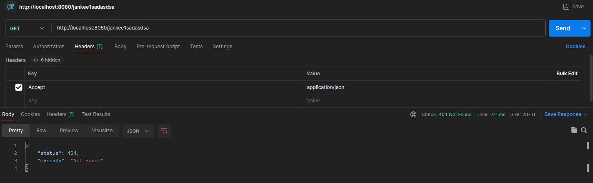

# GithubApi

## Description

GithubApi is a Java application that provides information about repositories for a given valid GitHub username. It retrieves details such as repository name, owner, and all branches with their last commit SHA (the application performs request(s) to "https://api.github.com/" under the hood).

Project utilizes:
- Java 21
- Spring Boot 3.2
- Lombok

## Installation Instructions

git clone

mvn clean install

java -jar target/<project_name>-<version>.jar

## Usage

Each request should be done to the below endpoint

http://localhost:8080/<valid_github_username>

### Invalid GitHub username
When request is initiated from client perspective, the application checks whether given username is valid. If validation will not be finished successfully - request to "https://api.github.com/" will not be performed and exception will be thrown.

### Username not found
For non-existing usernames exception is thrown

### Valid response
If given username is valid and such username exists - the application will retrieve an ArrayList with all data in synchronous manner.

### Rate limit exceeded
In case if rate limit will be exceeded (60 requests / hour for unauthenticated users) - exception will be thrown.

